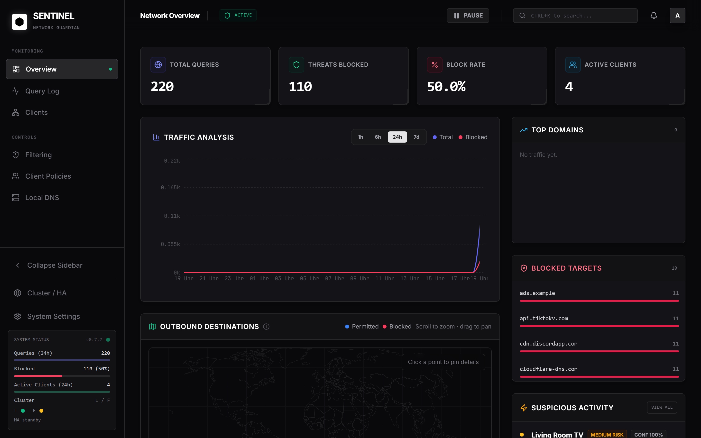
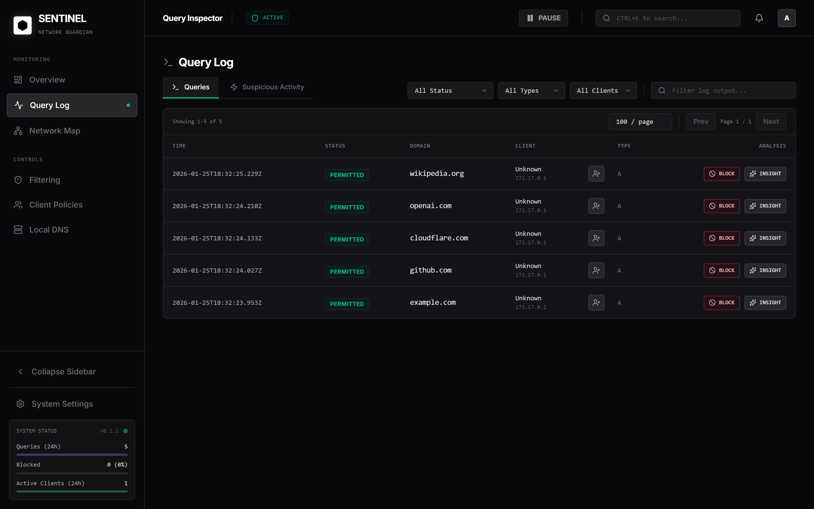
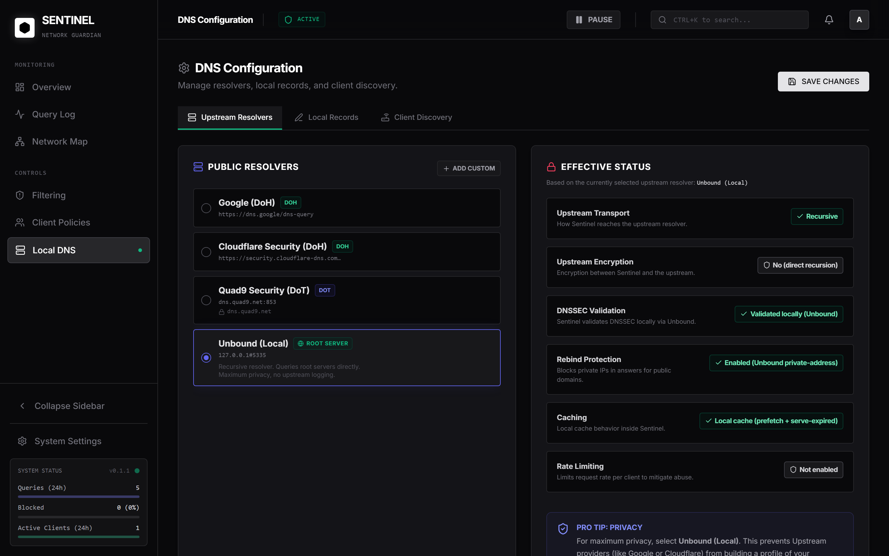
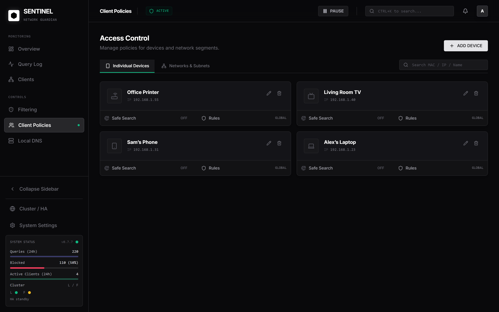

<div align="center">


<h1>Sentinel-DNS</h1>

<p>
  <b>The self-hosted DNS blocker appliance</b> (Pi-hole/AdGuard-style) with an honest Web UI, API, and an embedded DNS stack.
</p>

<p>
  <a href="https://github.com/robotnikz/sentinel-dns/stargazers">
    
  </a>
  <a href="https://github.com/robotnikz/sentinel-dns/issues">
    
  </a>
  <a href="https://github.com/robotnikz/sentinel-dns/commits/main">
    
  </a>
  <a href="https://github.com/robotnikz/sentinel-dns/actions/workflows/docker-publish.yml">
    
  </a>
  <a href="https://github.com/robotnikz/sentinel-dns/pkgs/container/sentinel-dns">
    
  </a>
  <a href="LICENSE">
    
  </a>
  <a href="https://docs.docker.com/compose/">
    
  </a>
</p>

<p>
  <a href="#quickstart">Quickstart</a>
  · <a href="#screenshots">Screenshots</a>
  · <a href="#remote-access-tailscale">Remote access</a>
  · <a href="#security--hardening">Security</a>
  · <a href="#troubleshooting">Troubleshooting</a>
</p>
</div>

---

## ⚡ What is Sentinel-DNS?

Sentinel-DNS is a **self-hosted, network-wide DNS blocker** (Pi-hole/AdGuard-style).
Point your router or devices to it as the DNS server and it will **filter ads/trackers/malware domains** before they reach your apps.

It also gives you the stuff you actually want day-to-day:

- a clear dashboard (what’s happening right now)
- per-client visibility (who is asking what)
- query logs when something breaks
- simple controls for allow/deny + local DNS records

It runs as **one Docker container** with a persistent data volume — no cloud dependency.

The UI is intentionally **honest**: status indicators are driven by real backend checks (no “always green” screens).

## ✨ Key Features

- **Fast setup:** run it, set DNS on router/clients, done
- **Per-client policies:** apply different blocklists / “app” categories / rules per device (kids, work laptop, smart TV, guests…)
- **Blocking controls:** blocklists + allow/deny rules + local DNS rewrites (local records)
- **Visibility:** query logs, per-client view, metrics, DNS Activity Map
- **Reverse DNS lookup:** see real hostnames when available (instead of just IPs)
- **Suspicious activity detection (heuristic):** highlights unusual DNS behavior so you can react quickly
- **Optional AI domain threat analysis (one click):** get instant feedback on a domain when you explicitly ask for it
- **Upstreams:** UDP / DoT / DoH (presets + custom resolvers)
- **Optional remote access:** built-in Tailscale support. Connect all your devices to the same Tailscale network and use your DNS blocker on-the-go

> [!NOTE]
> **AI features are optional and opt-in.** They require you to add a **Gemini or ChatGPT API key** in the UI.
> Sentinel-DNS will **never** contact an AI provider “in the background” — AI requests only happen on an **explicit user action** (e.g. clicking an analyze button).

## 📸 Screenshots

| **Dashboard** | **Query Logs** |
|:---:|:---:|
|  |  |
| **DNS Settings** | **Clients** |
|  |  |

## 🧭 Quickstart

Sentinel-DNS is shipped as a Docker image. You can run it on a Raspberry Pi, NAS, or any Linux server.

### 🧰 Docker Prerequisites

1. Docker Engine + Compose plugin installed
2. Ports open on your LAN: `53/udp`, `53/tcp`, `8080/tcp`

### 🧩 Method 1: Docker Compose (Recommended)

> [!TIP]
> For production, pin a version tag (e.g. `ghcr.io/robotnikz/sentinel-dns:0.1.1`) so upgrades/rollbacks are explicit.

Use the included compose file at `deploy/compose/docker-compose.yml` (or create your own):

```yaml
services:
  sentinel:
    # Single-container build: Web UI + API + embedded DNS stack
    image: ghcr.io/robotnikz/sentinel-dns:latest
    container_name: sentinel-dns
    ports:
      # DNS service (UDP/TCP). If port 53 is already in use (e.g. systemd-resolved),
      # adjust the host-side port mapping or disable the stub resolver.
      - "53:53/udp"
      - "53:53/tcp"
      # Web UI + API
      - "8080:8080"
    environment:
      # Timezone used for logs/UI timestamps.
      - TZ=Europe/Berlin
      # Ensure the Web UI/API is reachable via Docker port publishing.
      - HOST=0.0.0.0
      - PORT=8080
    volumes:
      # Persistent storage for data, settings, secrets, and the GeoIP database.
      - sentinel-data:/data
    # Required for embedded Tailscale (VPN / exit-node mode).
    cap_add:
      - NET_ADMIN
    devices:
      - /dev/net/tun:/dev/net/tun
    # Required for forwarding traffic when tailscale is acting as an exit node. (full traffic via Tailscale VPN)
    sysctls:
      net.ipv4.ip_forward: "1"
      net.ipv6.conf.all.forwarding: "1"
    restart: unless-stopped

volumes:
  sentinel-data:
```

Run it:

```bash
docker compose -f deploy/compose/docker-compose.yml up -d
```

> [!IMPORTANT]
> **Upgrade safety (data/history):** keep your `sentinel-data` volume. If you delete or change this mount, Sentinel will start fresh.

> [!IMPORTANT]
> **Port 53 conflicts are common on Linux** (e.g. `systemd-resolved`). If Sentinel fails to start, change the host port mapping in your compose file or disable the stub resolver.

### 🖥️ Method 2: Docker CLI

```bash
docker run -d \
  -p 8080:8080 \
  -p 53:53/udp \
  -p 53:53/tcp \
  -v sentinel-data:/data \
  -e TZ=Europe/Berlin \
  --cap-add=NET_ADMIN \
  --device=/dev/net/tun:/dev/net/tun \
  --sysctl net.ipv4.ip_forward=1 \
  --sysctl net.ipv6.conf.all.forwarding=1 \
  --restart unless-stopped \
  --name sentinel-dns \
  ghcr.io/robotnikz/sentinel-dns:latest
```

---

Once running:

- Web UI + API: `http://<server-ip>:8080`
- DNS service: `<server-ip>:53` (UDP/TCP)

## ✅ First run

On first start, create an admin user directly in the Web UI:

1. Open `http://<server-ip>:8080`
2. Create username + password (min 8 chars)
3. Log in (session cookie)

Optional AI features (Gemini / ChatGPT) can be enabled from the UI by adding an API key.
Keys are stored encrypted server-side.

Sentinel-DNS will only send an AI request when you explicitly trigger it (for example: “analyze this domain”).

## 🌐 Remote access (Tailscale)

Sentinel runs an embedded `tailscaled` so you can reach the UI/API over your tailnet.

If you enable **Exit Node** in the UI, Sentinel can act as your “VPN back home” (route all traffic through your home network).

1. In the Web UI: Settings -> Remote Access (Tailscale)
2. Click the sign-in/connect flow (browser auth) and complete the login
3. Optional: instead of browser auth, you can paste a reusable auth key from the Tailscale admin console
4. Approve exit-node advertisement in the Tailscale admin console (if enabled)

To route DNS through Sentinel for your tailnet devices, set your tailnet DNS nameserver(s) to Sentinel's Tailscale IP.

In the Tailscale admin console, ensure **Override DNS Servers** is enabled.

### Tailscale clients + Query Logs

If your tailnet devices use Sentinel as DNS but you **don't see any queries** in Query Logs, check the IP family used for DNS.

- Some Tailscale clients prefer the **IPv6 tailnet address** of the resolver (e.g. `fd7a:...`).
- Sentinel's DNS server must be listening on **IPv4 and IPv6** to see and log those requests.

Per-client policies for Tailscale work the same as LAN devices:

- Add each device as a client using its stable Tailscale IP (usually in `100.64.0.0/10`, or an IPv6 tailnet address).
- Or add a CIDR client for a whole tailnet range if you want one shared policy.

Once the DNS requests are logged, the Query Logs view can be used to identify the client IPs you should add.

Exit nodes are **not required** for tailnet DNS (DNS-only routing), but they work well together.

## 🗺️ GeoIP database

The dashboard world map uses a local MaxMind GeoLite2 database.

Recommended setup (no manual file copying):

1. In the Web UI: Settings -> GeoIP / World Map
2. Enter your MaxMind license key
3. Click update/download

Sentinel will download and refresh the GeoLite2 City database inside the persistent `/data` volume.

## 🔒 Security & Hardening

Sentinel-DNS is intended for self-hosting on a trusted network.

- If you expose the UI beyond your LAN, put it behind a reverse proxy with TLS.
- Do **not** expose port `53` to the internet.
- Prefer LAN/VPN access (Tailscale) instead of public DNS.

## 🛠️ Troubleshooting

```bash
docker compose ps
docker compose logs -f
curl -fsS http://<server-ip>:8080/api/health
```

More self-hosting/ops notes (upgrades, backups, port 53 conflicts):

- [docs/OPERATIONS.md](docs/OPERATIONS.md)

## 🧾 Notes on DNSSEC

With public upstream resolvers (Google/Cloudflare/Quad9), DNSSEC is typically validated by the upstream resolver.
If you want DNSSEC validation locally inside the appliance, use `Unbound (Local)`.

## 📜 Project policies

- License: [LICENSE](LICENSE)
- Contributing: [CONTRIBUTING.md](CONTRIBUTING.md)
- Security: [SECURITY.md](SECURITY.md)
- Code of Conduct: [CODE_OF_CONDUCT.md](CODE_OF_CONDUCT.md)
- Support: [SUPPORT.md](SUPPORT.md)

## ⚠️ Limitations

- Some upstream endpoints require HTTP/2 for DoH. If an upstream DoH endpoint is not compatible with the current client implementation, use DoT instead.
