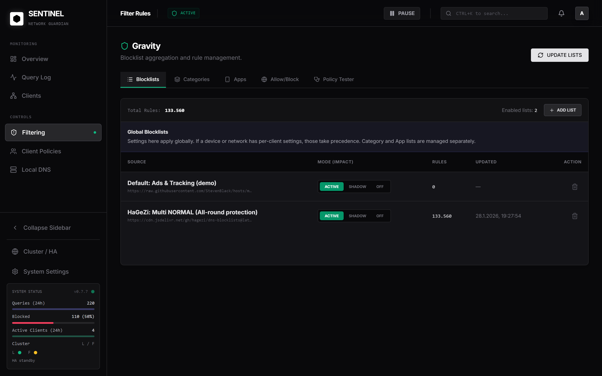
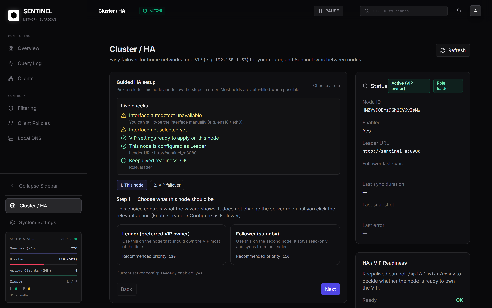

<div align="center">


<h1>Sentinel-DNS</h1>

<p>
  <b>The self-hosted DNS blocker appliance</b> (Pi-hole/AdGuard-style) with an honest Web UI, API, and an embedded DNS stack.
</p>

<p>
  <a href="https://github.com/robotnikz/sentinel-dns/stargazers">
    
  </a>
  <a href="https://github.com/robotnikz/sentinel-dns/issues">
    
  </a>
  <a href="https://github.com/robotnikz/sentinel-dns/commits/main">
    
  </a>
  <a href="https://github.com/robotnikz/sentinel-dns/actions/workflows/docker-publish.yml">
    
  </a>
  <a href="https://github.com/robotnikz/sentinel-dns/pkgs/container/sentinel-dns">
    
  </a>
  <a href="LICENSE">
    
  </a>
  <a href="https://docs.docker.com/compose/">
    
  </a>
</p>

<p>
  <a href="#quickstart">Quickstart</a>
  · <a href="#screenshots">Screenshots</a>
  · <a href="#security--hardening">Security</a>
  · <a href="#troubleshooting">Troubleshooting</a>
</p>
</div>

---

## ⚡ What is Sentinel-DNS?

Sentinel-DNS is a **self-hosted DNS blocker** (Pi-hole/AdGuard-style) that runs on your own server.
You point your router (or your devices) to Sentinel-DNS as the DNS server and it will **block ads/trackers/malware domains** before they reach your apps.

If you’re new to DNS blockers: don’t worry — the setup is basically “start the container → open the web UI → set router DNS”.

## ⭐ Why people choose Sentinel-DNS (vs. Pi-hole / AdGuard Home)

- **Sync + HA + Failover (2 nodes):** a floating VIP (keepalived/VRRP) + automatic **cluster sync** so DNS keeps working even if one node dies.
- **Per-client policies (device + subnet):** client-specific rules + domain/category/app blocklists (kids, guests, TVs, work devices, etc.)
- **Honest UI:** health/cluster indicators are backed by real checks (not just a green badge).

## ✨ Key Features (short)

- **Fast setup:** one container, persistent data volume
- **DNS filtering:** blocklists + allow/deny rules + local DNS rewrites
- **Client policies:** per device + per subnet
- **Blocklists:** domain lists + *Category:* lists + *App:* lists
- **Visibility:** query logs, metrics, DNS Activity Map
- **Encrypted upstream DNS:** UDP / DoT / DoH
- **Optional remote access:** Tailscale ([docs/REMOTE_ACCESS_TAILSCALE.md](docs/REMOTE_ACCESS_TAILSCALE.md))
- **Optional HA:** Sync + VIP failover ([docs/CLUSTER_HA.md](docs/CLUSTER_HA.md))

> [!NOTE]
> **AI features are optional and opt-in.** They require you to add a **Gemini or ChatGPT API key** in the UI.
> Sentinel-DNS will **never** contact an AI provider “in the background” — AI requests only happen on an **explicit user action** (e.g. clicking an analyze button).

## 📸 Screenshots

| **Dashboard** | **Query Logs** |
|:---:|:---:|
|  |  |
| **Filtering** | **Client Policies** |
|  |  |
| **DNS Settings** | **Cluster / HA** |
|  |  |

## 🧭 Quickstart

Sentinel-DNS is shipped as a Docker image. You can run it on a Raspberry Pi, NAS, mini PC, or server.

If you want the “just tell me what to do” version:

1) Start the container (commands below)
2) Open the Web UI: `http://<server-ip>:8080`
3) Create your admin account
4) Set your router’s DNS to the Sentinel IP (or VIP if you use HA)
5) Done ✅

More docs (advanced / deeper): start here: [docs/README.md](docs/README.md)

### 🧰 Docker Prerequisites

1. Docker Engine + Docker Compose installed
2. Your firewall allows LAN access to: `53/udp`, `53/tcp`, `8080/tcp`

> [!NOTE]
> **HA/VIP failover requires Linux hosts** (keepalived uses host networking). Single-node works anywhere Docker works.

### 🧩 Method 1: Docker Compose (Recommended)

> [!TIP]
> For production, pin a version tag (instead of `latest`) so upgrades/rollbacks are explicit.

**Fastest path:** use the repo’s compose file (it already includes the optional keepalived sidecar).

```yaml
# deploy/compose/docker-compose.yml
services:
  sentinel:
    image: ghcr.io/robotnikz/sentinel-dns:latest
    container_name: sentinel-dns
    ports:
      # DNS service (UDP/TCP). If port 53 is already in use (e.g. systemd-resolved),
      # adjust the host-side port mapping or disable the stub resolver.
      # By default this is published on all host interfaces (0.0.0.0).
      # To keep it reachable for all devices in your LAN while avoiding WAN exposure,
      # bind explicitly to your LAN interface IP (example 192.168.1.10):
      # - "192.168.1.10:53:53/udp"
      # - "192.168.1.10:53:53/tcp"
      - "53:53/udp"
      - "53:53/tcp"
      # Web UI + API
      # Same idea for the UI/API:
      # - "192.168.1.10:8080:8080"
      - "8080:8080"
    environment:
      # Timezone used for logs/UI timestamps.
      - TZ=Europe/Berlin
      # Ensure the Web UI/API is reachable via Docker port publishing.
      - HOST=0.0.0.0
      - PORT=8080
      # Optional: HA/VIP role override file (written by keepalived sidecar).
      # If you never configure HA in the UI, this file won't exist and Sentinel runs normally.
      - CLUSTER_ROLE_FILE=/data/sentinel/cluster_role
    volumes:
      # Persistent storage for Postgres data, settings, secrets, and the GeoIP database.
      - sentinel-data:/data
    # Required for embedded Tailscale (VPN / exit-node mode).
    cap_add:
      - NET_ADMIN
    devices:
      - /dev/net/tun:/dev/net/tun
    # Required for forwarding traffic when tailscale is acting as an exit node. (full traffic via Tailscale VPN)
    sysctls:
      net.ipv4.ip_forward: "1"
      net.ipv6.conf.all.forwarding: "1"
    restart: unless-stopped

  # Optional HA sidecar (VRRP/VIP via keepalived)
  # - Always included so users can enable HA from the UI without editing compose files.
  # - Does nothing until the UI writes /data/sentinel/ha/config.json (enabled=true).
  # - Requires Linux host networking and capabilities to add/remove the VIP on your LAN interface.
  keepalived:
    # Included by default so a simple `docker compose up -d` deploys everything.
    # The container stays idle until the UI enables VIP failover (writes /data/sentinel/ha/config.json).
    image: ghcr.io/robotnikz/sentinel-dns-keepalived:latest
    container_name: sentinel-keepalived
    network_mode: host
    restart: unless-stopped
    cap_add:
      - NET_ADMIN
      - NET_RAW
      - NET_BROADCAST
    environment:
      - DATA_DIR=/data
      - HA_CONFIG_FILE=/data/sentinel/ha/config.json
      - HA_ROLE_FILE=/data/sentinel/cluster_role
      - HA_NETINFO_FILE=/data/sentinel/ha/netinfo.json
      - HA_READY_URL=http://127.0.0.1:8080/api/cluster/ready
    volumes:
      - sentinel-data:/data

volumes:
  sentinel-data:
```

Or download the compose file directly and run it:

```bash
# Linux/macOS
curl -fsSL -o docker-compose.yml https://raw.githubusercontent.com/robotnikz/sentinel-dns/main/deploy/compose/docker-compose.yml
docker compose up -d

# Windows PowerShell
curl.exe -fsSL -o docker-compose.yml https://raw.githubusercontent.com/robotnikz/sentinel-dns/main/deploy/compose/docker-compose.yml
docker compose up -d
```

VIP/HA failover (keepalived) is included by default in that compose file. Enable it in the UI (Cluster / HA) after startup.

The source of truth is always [deploy/compose/docker-compose.yml](deploy/compose/docker-compose.yml).


> [!IMPORTANT]
> **Upgrade safety (data/history):** keep your `sentinel-data` volume. If you delete or change this mount, Sentinel will start fresh.

> [!IMPORTANT]
> **Port 53 conflicts are common on Linux** (e.g. `systemd-resolved`). If Sentinel fails to start, change the host port mapping in your compose file or disable the stub resolver.

### 🖥️ Method 2: Docker CLI

```bash
docker run -d \
  -p 8080:8080 \
  -p 53:53/udp \
  -p 53:53/tcp \
  -v sentinel-data:/data \
  -e TZ=Europe/Berlin \
  --restart unless-stopped \
  --name sentinel-dns \
  ghcr.io/robotnikz/sentinel-dns:latest

# Note: for remote access (Tailscale) / Exit Node, extra privileges are required.
# See: docs/REMOTE_ACCESS_TAILSCALE.md
```

---

Once running:

- Web UI + API: `http://<server-ip>:8080`
- DNS service: `<server-ip>:53` (UDP/TCP)

## 🧠 Important concept (Leader / Follower)

If you enable **Sync/HA**:

- You make changes on the **Leader** (settings, clients, blocklists, rules…)
- The **Follower automatically syncs** and is **read-only**
- Your network uses the **VIP** (virtual IP) as DNS, so failover is transparent

## ✅ First run

On first start, create an admin user directly in the Web UI:

1. Open `http://<server-ip>:8080`
2. Create username + password (min 8 chars)
3. Log in (session cookie)

Optional AI features (Gemini / ChatGPT) can be enabled from the UI by adding an API key.
Keys are stored encrypted server-side.

Sentinel-DNS will only send an AI request when you explicitly trigger it (for example: “analyze this domain”).

## 🧩 Client policies (what makes Sentinel powerful)

In **Clients / Client Policies** you can create policies for:

- **Individual devices** (by IP/MAC)
- **Networks & Subnets** (e.g. guest Wi‑Fi)

Each client policy can have different filtering, for example:

- stricter blocking for kids devices
- relaxed rules for a Smart TV
- a “work” profile that blocks distractions

### Blocklists: domain vs category vs app

Sentinel supports multiple kinds of lists:

- **Domain blocklists** (classic ad/tracker lists)
- **Category blocklists** (e.g. "Category: adult", "Category: gambling")
- **App blocklists** (e.g. "App: tiktok", "App: youtube")

You can enable these globally and/or per client.

## 🗺️ GeoIP database

The dashboard world map uses a local MaxMind GeoLite2 database.

Recommended setup (no manual file copying):

1. In the Web UI: Settings -> GeoIP / World Map
2. Enter your MaxMind license key
3. Click update/download

Sentinel will download and refresh the GeoLite2 City database inside the persistent `/data` volume.

## 🔒 Security & Hardening

Sentinel-DNS is intended for self-hosting on a trusted network.

- If you expose the UI beyond your LAN, put it behind a reverse proxy with TLS.
- Do **not** expose port `53` to the internet.
- Prefer LAN/VPN access (Tailscale) instead of public DNS.

## 🛠️ Troubleshooting

```bash
docker compose ps
docker compose logs -f
curl -fsS http://<server-ip>:8080/api/health
```

More self-hosting/ops notes (upgrades, backups, port 53 conflicts):

- [docs/OPERATIONS.md](docs/OPERATIONS.md)

## 🧾 Notes on DNSSEC

With public upstream resolvers (Google/Cloudflare/Quad9), DNSSEC is typically validated by the upstream resolver.
If you want DNSSEC validation locally inside the appliance, use `Unbound (Local)`.

## 📜 Project policies

- License: [LICENSE](LICENSE)
- Contributing: [CONTRIBUTING.md](CONTRIBUTING.md)
- Security: [SECURITY.md](SECURITY.md)
- Code of Conduct: [CODE_OF_CONDUCT.md](CODE_OF_CONDUCT.md)
- Support: [SUPPORT.md](SUPPORT.md)

## ⚠️ Limitations

- Some upstream endpoints require HTTP/2 for DoH. If an upstream DoH endpoint is not compatible with the current client implementation, use DoT instead.
